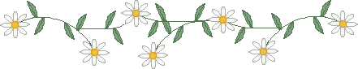

# Site Style Guide

## Overview
This is a personal website inspired by the IndieWeb and Neocities aesthetic. Think pd187.neocities.org meets inkcaps.neocities.org — weird, hand-crafted, expressive.

## Visual Style
- **Dark mode by default** — deep purple/black background with starry GIF tile
- **Color palette:**
  - Background: #0a0a12 (near black)
  - Text: #e0ffe0 (soft green)
  - Accent pink: #ff66cc
  - Accent purple: #cc66ff
  - Accent cyan: #66ffff
  - Accent gold: #ffcc00
  - Links: #66ccff (hover: #ff99ff)
  - Glow effects on headers and highlights

## Typography
- **Fonts:** VT323 (monospace), Pixelify Sans (pixel headers)
- **Headers:** All caps, letter-spacing, glow effects
- **Body:** 1.2rem, line-height 1.5

## Layout Structure
Every page should have:
1. **Floater decorations** — Small animated GIFs in corners (use existing ones in img/)
2. **Container** — Max-width 800px, purple border, semi-transparent background
3. **Header** — Rainbow animated title + subtitle + divider
4. **Nav** — home ★ links ★ about ★ journal (star separators)
5. **Main content** — Sections with left borders, dividers between
6. **Footer** — 88x31 buttons, colophon, copyright

## HTML Patterns

### Page Header
```html
<header>
  <h1 class="rainbow-text">
    <span>T</span><span>I</span><span>T</span><span>L</span><span>E</span>
  </h1>
  <p class="subtitle">tagline here</p>
  
</header>
```

### Section
```html
<section class="about-section">
  <h2>✧ section title ✧</h2>
  <p>Content here...</p>
</section>


```

### Link Lists
```html
<ul class="links">
  <li>
    <a href="url" target="_blank">Link Title</a>
    <span class="desc">— description</span>
  </li>
</ul>
```

## Decorative Elements
- Use ✧ ✦ ★ for section headers
- Use `<span class="date-glow">text</span>` for glowing highlights
- Use `<p class="whisper">text</p>` for dim, italic asides
- Dividers: Alternate between divider1.gif and divider2.gif

## Assets Available
- img/divider1.gif, img/divider2.gif — section dividers
- img/star1.gif, img/star2.gif, img/spiral.gif — floaters
- img/new.gif — "update" icon
- img/email.gif — email icon
- img/undercon.gif — under construction
- img/buttons/*.gif — 88x31 buttons

## Content Rules
- **NO personal identifying info** — no real names, specific locations, etc.
- Keep it weird, expressive, personal (but anonymous)
- Embrace the hand-crafted aesthetic
- It's okay to be playful and strange

## File Naming
- All lowercase
- Hyphens for spaces
- Pages: `page-name.html`
- Journal entries: `journal/YYYY-MM-DD-title.html`
